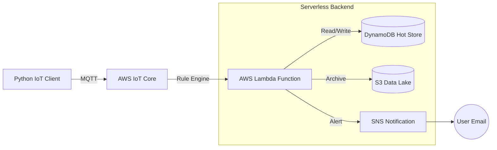

# Serverless IoT Weather Monitoring & Analytics System (AWS)

## ☁️ Project Overview
This project demonstrates a **Cloud-Native IoT Architecture** capable of ingesting, processing, and storing real-world environmental data without managing a single server. By leveraging **AWS Serverless** technologies, the system fetches live weather data for Buffalo, NY, and routes it through a robust data pipeline for real-time analytics and user alerting.

> **Architecture Style:** Event-Driven Serverless (Pub/Sub)\
> **Cloud Provider:** Amazon Web Services (AWS)\
> **Language:** Python 3 (Boto3 SDK)

## jn️ AWS Services Implemented
This project orchestrates the following AWS services to create a scalable pipeline:

### 1. AWS IoT Core (The Gateway)
* **Role:** Acts as the central message broker (MQTT) ensuring secure device connectivity.
* **Implementation:** Configured **X.509 Certificate-based authentication** to securely ingest JSON payloads from the edge device.
* **Routing:** Utilized **IoT Rules Engine** (SQL-based) to intercept incoming messages on `weather/data` and route them to the application layer.

### 2. AWS Lambda (Compute)
* **Role:** Serverless compute service that executes business logic on-demand.
* **Function:** Triggered by IoT Core; parses the weather payload, determines "Clothing Recommendations" (e.g., "Wear a Jacket"), and orchestrates downstream storage.

### 3. Amazon DynamoDB (Hot Storage)
* **Role:** NoSQL Database for low-latency, real-time data retrieval.
* **Schema:** Partition Key: `device_id` | Sort Key: `timestamp`.
* **Usage:** Stores the most recent weather readings for immediate dashboard visualization.

### 4. Amazon S3 (Cold Storage / Data Lake)
* **Role:** Object storage for long-term archiving and compliance.
* **Usage:** Raw JSON payloads are archived here to build a historical dataset for future machine learning models.

### 5. Amazon SNS (Notifications)
* **Role:** Simple Notification Service for urgent alerts.
* **Trigger:** Sends an email notification to the user if specific weather thresholds are met (e.g., "Storm Alert").

### 6. IAM (Security & Access)
* **Role:** Identity and Access Management.
* **Implementation:** Created a "Least Privilege" role allowing Lambda specifically to `PutItem` in DynamoDB and `Publish` to SNS, ensuring granular security.

## 🏗 System Architecture

## 💻 Technical Implementation
* The device-side logic utilizes the AWS IoT Device SDK for Python to establish a secure mTLS connection.\
  
  # snippet from src/main.py
  
    mqtt_connection = mqtt_connection_builder.mtls_from_path\
  (\
    endpoint=ENDPOINT,\
    cert_filepath="certs/certificate.pem.crt",\
    pri_key_filepath="certs/private.pem.key",\
    client_id="MacBook_Buffalo_Sensor"\
  )

## 👤 Developer
Kesava Satish Boppana
